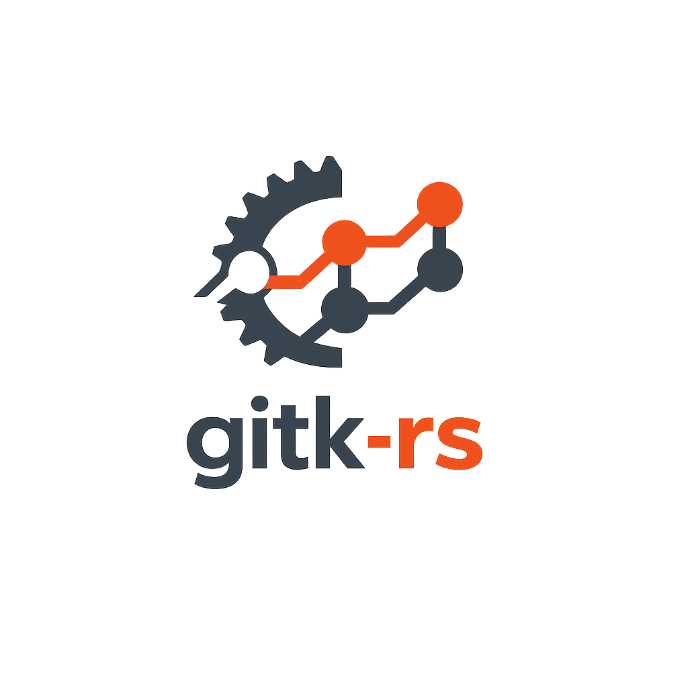

<p align="center">
  
</p>

<h1 align="center">GitK-RS</h1>

<p align="center">
  <b>A modern Git visualization tool written in Rust with a React frontend, built with Tauri.</b>
</p>

<p align="center">
  <a href="https://github.com/vicheanath/gitk-rs/actions"></a>
  <a href="https://github.com/vicheanath/gitk-rs/blob/main/LICENSE"></a>
  <a href="https://tauri.app/"></a>
  <a href="https://www.rust-lang.org/"></a>
  <a href="https://react.dev/"></a>
</p>

<p align="center">
  
  <br>
  <i>GitK-RS commit graph and UI demo</i>
</p>

---

## 🚀 Features

<ul>
  <li><b>Commit Graph Visualization</b>: Interactive DAG visualization with zoom, pan, and node selection</li>
  <li><b>Branch Management</b>: View, create, checkout, and delete branches</li>
  <li><b>Tag Browsing</b>: Explore repository tags</li>
  <li><b>Commit Details</b>: View commit metadata, changed files, and diffs</li>
  <li><b>Search</b>: Search commits by message</li>
  <li><b>Keyboard Shortcuts</b>: Navigate efficiently with keyboard</li>
  <li><b>Dark/Light Theme</b>: Toggle between themes</li>
  <li><b>Cross-platform</b>: Works on Linux, macOS, and Windows</li>
</ul>

## 📦 Prerequisites

- <a href="https://nodejs.org/">Node.js</a> (v18 or later)
- <a href="https://www.rust-lang.org/">Rust</a> (latest stable)
- <a href="https://git-scm.com/">Git</a> (for the repository you want to visualize)

## 🛠️ Installation

1. Clone the repository:
   ```bash
   git clone https://github.com/vicheanath/gitk-rs.git
   cd gitk-rs
   ```
2. Install dependencies:
   ```bash
   npm install
   ```
3. Build the application:
   ```bash
   npm run tauri build
   ```

## 👩‍💻 Development

To start the development server:

```bash
npm run tauri dev
```

This will start the Vite dev server and launch the Tauri application.

## 🧑‍🎨 Usage

1. Launch the application
2. Click <b>Open Repository</b> and select a Git repository
3. Explore the commit graph, branches, and tags
4. Click on commits to view details and diffs
5. Use keyboard shortcuts for quick navigation

## ⌨️ Keyboard Shortcuts

| Shortcut    | Action                        |
|-------------|------------------------------|
| `/`         | Focus search bar              |
| `b`         | Toggle sidebar                |
| `q`         | Quit application              |
| Arrow keys  | Navigate commits (coming soon)|

## 📁 Project Structure

```text
gitk-rs/
├── src-tauri/          # Rust backend
│   ├── src/
│   │   ├── git_engine/ # Git operations
│   │   ├── app_core/   # State management
│   │   └── commands.rs # Tauri commands
│   └── Cargo.toml
├── src/                # React frontend
│   ├── components/     # UI components
│   ├── hooks/          # React hooks
│   ├── types/          # TypeScript types
│   └── styles/         # CSS styles
└── package.json
```

## 🧰 Technologies

- <b>Backend</b>: <a href="https://www.rust-lang.org/">Rust</a>, <a href="https://libgit2.org/">libgit2</a>, <a href="https://tauri.app/">Tauri</a>
- <b>Frontend</b>: <a href="https://react.dev/">React</a>, <a href="https://www.typescriptlang.org/">TypeScript</a>, <a href="https://vitejs.dev/">Vite</a>
- <b>State Management</b>: React Context API (MVVM pattern)
- <b>Graph Library</b>: <a href="https://github.com/petgraph/petgraph">Petgraph</a> (Rust), Canvas API (JavaScript)

## 📄 License

This project is licensed under the MIT License. See the [LICENSE](./LICENSE) file for details.

